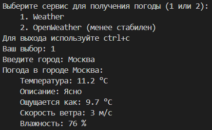

# Получение погоды по названию города
Задание:

## Quick start
Точка входа в приложение - файл [first.py](./first.py "ссылка на файл"). Для запуска требуется установить необходимые зависимости. Используйте команду: `pip install -r requirements.txt`. Также необходимо создать .env файл, хранящий API-ключи для сервисов. Пример файла: [sample.env](./sample.env "ссылка на файл").

Для получения API ключей можно перейти по ссылкам ниже (требуется регистрация):
- [OpenWeather](https://home.openweathermap.org/api_keys "клик")
- [WeatherApi](https://www.weatherapi.com/my/ "клик")

## Введение
Требования:
- Доступ по API
- Ввод города пользователем
- Вывод погоды пользователю

Формат ответа:
- Название города
- Темепаратура (в градусах Цельсия)
- Описание погоды
- Уровень влажности

## Решение
Для решения данной задачи получаем API ключ сервиса, отправляем get запрос по полученному ключу, обрабатываем полученные значения.
Возникшие проблемы:
- API предложенного сервиса работает нестабильно. В качестве решения был найден аналогичный сервис, работающий более стабильно. Пользователю предлагается выбор между сервисами
- Необходима конвертация величин. Решение: создание функций для конвертации

## Заключение
Текущий вариант реализации задачи считаю полностью завершённым, а задачу выполненной.

