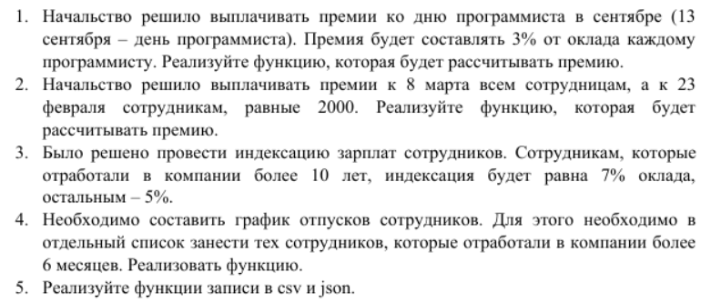
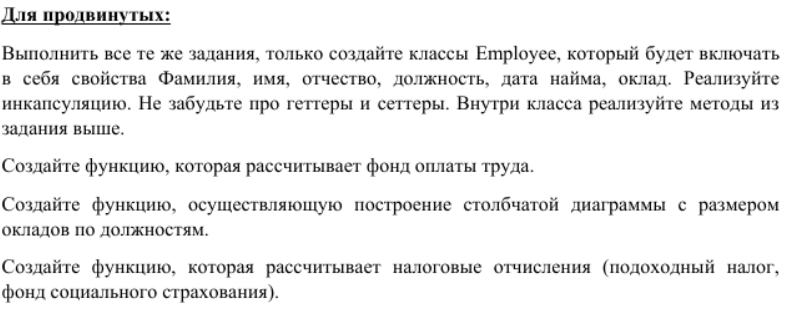
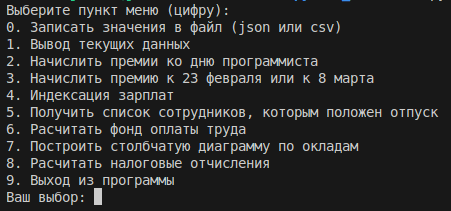
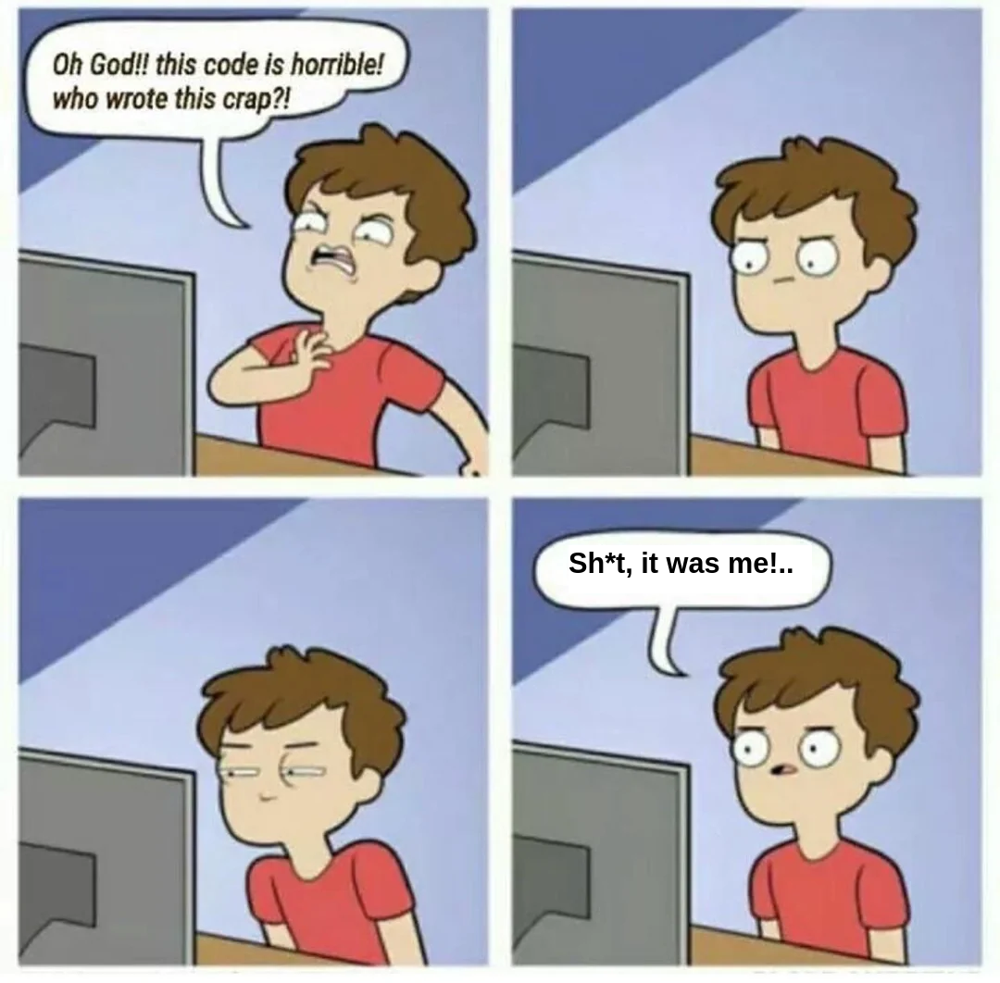

# Помощник начальника
## Задание (основное)

## Функциональные требования
1. Расчёт премии в день программиста (13 сентября, 3% от оклада каждому программисту)
2. Премия в размере 2000 на 8 марта и 23 февраля
3. Индексация (10+ лет в компании - 7%, иначе - 5%)
4. Список сотрудников, отработавших 6+ месяцев
5. Функция записи в csv и json файлы

## Функциональные требования (продвинутая часть)
1. Создать класс Employee. Требования: 
    1. Свойства:
        - Фамилия
        - Имя
        - Отчество
        - Должность
        - Дата найма
        - Оклад
    2. Инкапсуляция:
        - Геттеры
        - Сеттеры
    3. Реализовать методы, описанные выше, внутри класса
2. Функция, рассчитывающая фонд оплаты труда
3. Функция, строящая столбчатые диаграммы с размером окладов по должностям
4. Функция, которая расчитывает налоговые отчисления:
    - Подоходный налог
    - Фонд социального страхования

## Реализация:
Все функции были реализованы в меню с пунктами выбора:

 Все пункты во внутренних функциях также выбираются с помощью цифр или y/n. Пользователю даются интуитивно понятные подсказки по навигации.

 Начисление премий происходит в рамках запущенного файла. Исходный файл не затрагивается никак. Для сохранения всех начисленных премий и проиндексированных зарплат можно воспользоваться пунктом _0. Записать значения в файл (json или csv)_. Для просмотра текущих изменений пользователь может обратиться к пункту меню _1. Вывод текущих данных_. При построении диаграм есть возможность просмотреть полученную диаграмму в отдельном окне во время работы программы.

 Для того, чтобы окно терминала не засорялось, была написана функция _clear()_, которая позволяет корректно очищать окно терминала для любой системы.

 В результате разработки был реализован класс "Employee", который был вынесен в отдельный файл. Были прописаны все геттеры, сеттеры, а также статикметоды, если они были необходимы для реализации функционала.

 ## P.s.
 Автор (горе-разработчик) не претендует на clear code, а также на правильную реализацию многих функций. Но оно работает
 